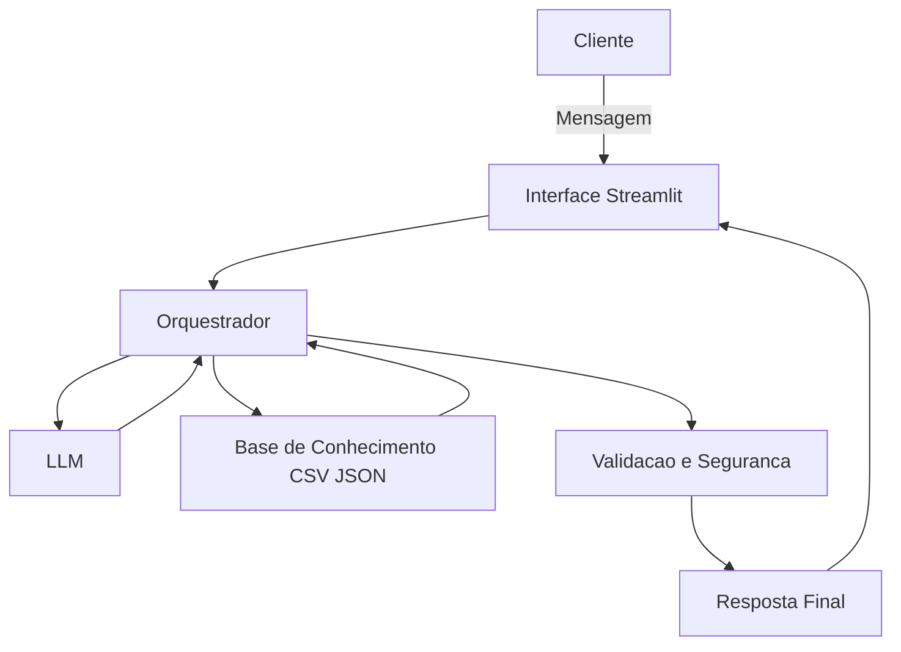

# Documentação do Agente

## Caso de Uso

### Problema
> Qual problema financeiro seu agente resolve?

Muitas pessoas têm dificuldade em controlar seus gastos e tomar decisões financeiras, principalmente por falta de conhecimento ou orientação personalizada.
Além disso, aplicativos tradicionais apenas mostram dados, mas não ajudam o usuário a entender ou agir sobre eles.

### Solução
> Como o agente resolve este problema de forma proativa?

O agente financeiro resolve esse problema atuando de forma proativa e inteligente, analisando os dados do usuário (transações, perfil e histórico) para:

Identificar padrões de consumo
Alertar sobre gastos excessivos
Sugerir formas de economia
Recomendar produtos financeiros adequados ao perfil
Simular cenários de investimento

👉 Diferencial: o agente não apenas responde perguntas, mas antecipa necessidades e orienta o usuário.

### Público-Alvo
> Quem vai usar esse agente?

Pessoas com pouco conhecimento financeiro
Usuários de aplicativos bancários
Jovens e adultos que desejam organizar suas finanças
Clientes que querem começar a investir

---

## Persona e Tom de Voz

### Nome do Agente
FinBot – Assistente Financeiro Inteligente

### Personalidade
> Como o agente se comporta? (ex: consultivo, direto, educativo)

O agente possui um comportamento:

Consultivo
Educativo
Proativo
Confiável

Ele atua como um consultor financeiro pessoal, ajudando o usuário a tomar decisões mais seguras.

### Tom de Comunicação
> Formal, informal, técnico, acessível?

Linguagem simples e acessível
Pouco uso de termos técnicos
Tom amigável e direto
Foco em clareza e orientação prática

### Exemplos de Linguagem
- Saudação: “Olá! Como posso te ajudar a melhorar suas finanças hoje? 💰”
- Confirmação: “Entendi! Vou analisar seus dados para te dar a melhor resposta.”
- Erro/Limitação: “Não tenho dados suficientes para responder com segurança, mas posso te ajudar com outras informações.”

---

## Arquitetura

### Diagrama

### Componentes

| Componente | Descrição |
|------------|-----------|
| Interface | Chatbot interativo em Streamlit |
| LLM | Ollama (local) |
| Base de Conhecimento | Arquivos CSV e JSON com dados do usuário |
| Validação | Verificação de respostas seguras e coerentes |

---

## Segurança e Anti-Alucinação

### Estratégias Adotadas

- [x] O agente responde apenas com base nos dados fornecidos
- [x] Não inventa informações
- [x] Quando não tem certeza, informa claramente
- [x] Evita recomendações financeiras arriscadas
- [x] Considera o perfil do investidor antes de sugerir qualquer produto
- [x] Pode indicar a fonte dos dados utilizados (ex: transações, perfil)

### Limitações Declaradas
> O que o agente NÃO faz?

O agente NÃO:

Faz previsões de mercado financeiro
Garante lucros ou retornos
Substitui um especialista financeiro humano
Responde perguntas fora do contexto financeiro
Toma decisões automáticas pelo usuário
Funciona sem dados suficientes do cliente
